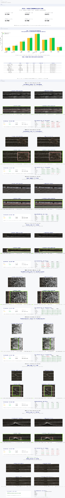
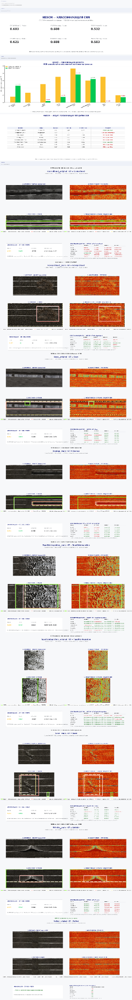
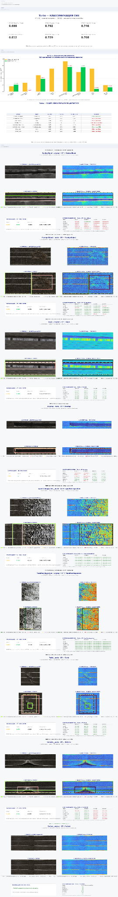
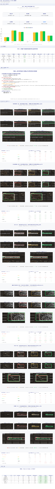
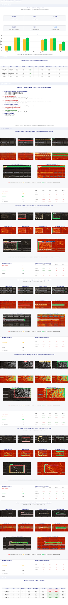

# CarbonDefect Research

Исследовательский проект по распознаванию дефектов углекомпозитного полотна
с использованием компьютерного зрения и свёрточных нейронных сетей.

Проект развивается в рамках научной работы по созданию методов распознавания
дефектов материала на устройствах с ограниченными вычислительными ресурсами.

## Цель проекта

Исследовать, как различные представления изображения влияют на качество
классификации дефектов углекомпозитного полотна, сравнить несколько готовых
CNN-архитектур в одинаковых условиях и подготовить основу для собственной
модели CarbonDefectNet.

## Классы

Текущая постановка включает 7 классов дефектов:

- CentralBand
- ForeignObject
- Gaps
- Overlap
- TapeDisintegration
- Twist
- Wrinkle

В 8-классовой постановке дополнительно используется класс:

- Perfect

## Представления изображений

В экспериментах сравниваются 6 вариантов входных данных:

1. RGB
2. Grayscale
3. Viridis
4. Inferno
5. Turbo
6. HEDCM

### HEDCM

HEDCM — экспериментальный метод предварительной обработки, направленный на
усиление локальных отклонений структуры материала.

Упрощённая схема:

```text
RGB image
   ↓
homogenization / darkening
   ↓
local background estimation
   ↓
absolute local deviation
   ↓
robust normalization
   ↓
CLAHE
   ↓
defect anomaly map
   ↓
HEDCM representation
```

## CNN-архитектуры

В benchmark используются:

- ResNet18
- EfficientNet-B0
- MobileNetV3-Small
- DenseNet121
- ConvNeXt-Tiny
- Swin-Tiny

Таким образом, исследовательская матрица включает:

```text
6 representations × 6 CNN architectures = 36 combinations
```

и две постановки задачи:

```text
7-class: defects only
8-class: Perfect + defects
```

## Основные метрики

В проекте сохраняются и анализируются:

- Accuracy
- Balanced Accuracy
- Macro Precision
- Macro Recall
- Macro-F1
- Weighted F1
- Per-class Precision / Recall / F1
- Confusion Matrix
- ROC-AUC
- PR-AUC
- Defect Recall при фиксированном False Positive Rate
- Inference time
- FPS
- Parameters
- FLOPs
- GPU memory

Основная метрика классификации — **Macro-F1**.

## Текущие результаты

Ниже приведены лучшие значения Macro-F1, зафиксированные в текущих Colab-экспериментах.
Это **промежуточные исследовательские результаты**, а не окончательные значения диссертации.

| Представление | 7-class best Macro-F1 | 8-class direct | 8-class conditional |
|---|---:|---:|---:|
| RGB | 1.000 | 0.810 | — |
| Grayscale | 1.000 | 0.857 | 1.000 |
| Viridis | 0.810 | 0.810 | 0.810 |
| Inferno | 1.000 | 1.000 | 1.000 |
| Turbo | 1.000 | 0.857 | 1.000 |
| HEDCM | 1.000 | 0.810 | 0.810 |

> Высокие значения на отдельных запусках не интерпретируются как окончательная
> оценка обобщающей способности модели. Проект требует дальнейшего расширения
> независимых исходных данных и финального source-level test split.

## Примеры отчётов

На GitHub отчёты развёрнуты на всю ширину страницы, чтобы их можно было просматривать ближе к тому, как они выглядят в Google Colab. Нажмите на изображение, чтобы открыть оригинал отдельно и увеличить его.

### RGB — классификация CNN

<a href="docs/images/rgb_classification_report.png">
  
</a>

[Открыть RGB-ноутбук в репозитории](notebooks/01_RGB.ipynb)

### HEDCM — классификация CNN

<a href="docs/images/hedcm_classification_report.png">
  
</a>

[Открыть HEDCM-ноутбук в репозитории](notebooks/06_HEDCM.ipynb)

### Turbo — классификация CNN

<a href="docs/images/turbo_classification_report.png">
  
</a>

[Открыть Turbo-ноутбук в репозитории](notebooks/05_TURBO.ipynb)

### RGB — локализация и сравнение рамок

<a href="docs/images/rgb_localization_report.png">
  
</a>

[Открыть RGB-ноутбук с полным выводом](notebooks/01_RGB.ipynb)

### HEDCM — локализация и сравнение рамок

<a href="docs/images/hedcm_localization_report.png">
  
</a>

[Открыть HEDCM-ноутбук с полным выводом](notebooks/06_HEDCM.ipynb)

## Логика эксперимента

```text
real carbon-fiber canvas
        ↓
canonical 256×256 patches
        ↓
6 image representations
        ↓
6 pretrained CNN architectures
        ↓
7-class / 8-class classification
        ↓
GT-crop evaluation
        ↓
operational localization + E2E evaluation
        ↓
quality / speed / model-size comparison
```

Manual GT используется для оценки качества и не должен использоваться для
подбора автоматической рамки локализатора.

## Производственная постановка

Для 8-классовой модели дополнительно рассматривается бинарная задача:

```text
Perfect vs Any Defect
```

Для неё рассчитываются sensitivity, specificity, ROC-AUC, PR-AUC,
false-positive rate и false-negative rate.

Для будущего видеоэтапа планируется:

```text
Video
  ↓
ROI / sliding windows
  ↓
HEDCM
  ↓
CNN
  ↓
temporal smoothing
  ↓
defect event detection
```

с метриками Event Recall, Event Precision, False Alarms/min, Detection Latency,
Total Latency и FPS.

## CarbonDefectNet — следующий этап

После завершения benchmark планируется собственная лёгкая архитектура:

```text
RGB information
      +
HEDCM anomaly information
      +
multi-scale features
      +
attention
      +
lightweight backbone
      ↓
CarbonDefectNet
      ├── Defect Head: Perfect / Defect
      └── Type Head: 7 defect classes
```

Финальная модель будет выбираться не только по максимальному F1, но по балансу:

```text
quality + latency/FPS + model size/FLOPs
```

## Структура репозитория

```text
carbon-defect-research/
├── README.md
├── requirements.txt
├── src/
│   ├── preprocessing.py
│   ├── models.py
│   └── metrics.py
├── notebooks/
│   ├── 01_RGB.ipynb
│   ├── 02_GRAYSCALE.ipynb
│   ├── 03_VIRIDIS.ipynb
│   ├── 04_INFERNO.ipynb
│   ├── 05_TURBO.ipynb
│   └── 06_HEDCM.ipynb
├── results/
│   └── current_summary.csv
└── docs/
    ├── methodology.md
    ├── project_status.md
    └── images/
```

## Статус проекта

> 🚧 **Проект находится в активной разработке.**

Текущая версия содержит подготовленный датасет, шесть вариантов представления
изображений, benchmark готовых CNN, GT-crop и end-to-end эксперименты, а также
инструменты локализации дефектов.

Следующие этапы: расширение независимых исходных данных, видеоэксперименты,
измерение полной задержки pipeline, FP16/INT8 benchmark и разработка
CarbonDefectNet.

---

**Автор:** Сергей Каличенок  
**Направление:** компьютерное зрение / анализ данных / нейронные сети  
**Статус:** research project — work in progress
